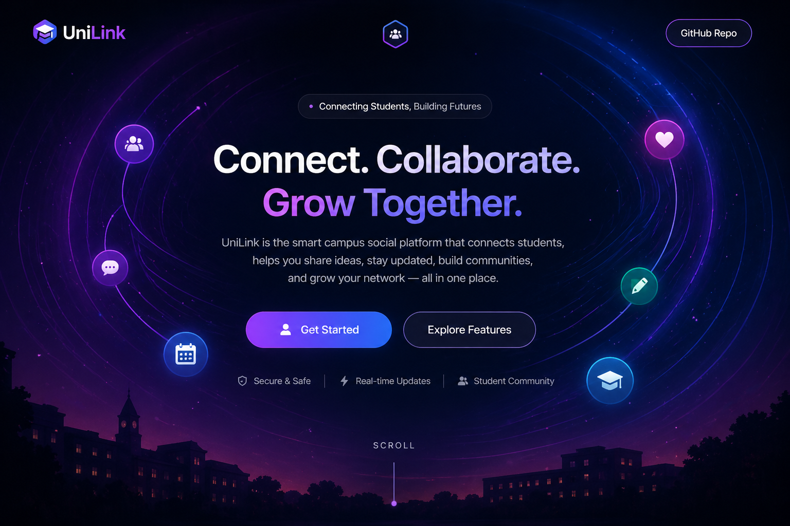

````md
# 🎓 UniLink

**Smart Campus Social & Communication Platform for Students**

> *Built using MERN Stack with JWT Authentication & Tailwind CSS*



---

## 📌 What is UniLink?
UniLink is a modern **student networking and campus communication platform** designed to connect university students in one place. It helps students interact, share updates, create profiles, build communities, and stay informed about campus activities.

Students can sign up, log in securely, create posts, upload profile images, send messages, and connect with other students in real time.

UniLink aims to simplify student life by combining social networking, collaboration, and communication into one smart platform.

---

## 🏗️ Architecture

```bash
Frontend (React + Vite + Tailwind CSS)
        │
        ▼
REST API (Node.js + Express.js)
        │
        ▼
MongoDB Atlas Database
        │
        ▼
Cloudinary Image Storage
````

---

## ✨ Key Features

### 🔐 Secure Authentication

* User Signup / Login
* JWT Token Authentication
* Protected Routes
* Session Management

### 👤 Student Profiles

* Create & Edit Profile
* Upload Profile Picture
* Bio / Department / Skills

### 📰 Social Feed

* Create Posts
* Like / Comment
* Campus Updates

### 💬 Real-Time Communication

* Private Messaging
* Connect with Students

### ☁️ Image Upload

* Cloudinary Integration
* Fast & Secure Media Hosting

### 📱 Responsive UI

* Mobile Friendly Design
* Clean Interface using Tailwind CSS

---

## 🛠️ Tech Stack

| Layer          | Technology           |
| -------------- | -------------------- |
| Frontend       | React.js + Vite      |
| Styling        | Tailwind CSS         |
| Backend        | Node.js + Express.js |
| Database       | MongoDB Atlas        |
| Authentication | JWT                  |
| Media Storage  | Cloudinary           |
| Deployment     | Netlify + Render     |

---

## 🚀 Getting Started

### Prerequisites

* Node.js installed
* MongoDB Atlas account
* Cloudinary account

---

## 💻 Local Development

```bash
# Clone repository
git clone https://github.com/yourusername/UniLink.git

# Install frontend dependencies
cd frontend
npm install

# Install backend dependencies
cd ../backend
npm install

# Run frontend
npm run dev

# Run backend
npm start
```

---

## 🔑 Environment Variables

Create `.env` file inside backend:

```env
PORT=5001
MONGO_URI=your_mongodb_uri
JWT_SECRET=your_secret_key
NODE_ENV=development

CLOUDINARY_CLOUD_NAME=your_cloud_name
CLOUDINARY_API_KEY=your_api_key
CLOUDINARY_API_SECRET=your_api_secret
```

Create `.env` inside frontend:

```env
VITE_API_URL=https://your-backend.onrender.com
```

---

## 🌐 Deployment

### Frontend:

Deploy on Netlify

### Backend:

Deploy on Render

### Database:

MongoDB Atlas

---

## 📡 API Endpoints

| Method | Endpoint            | Description      |
| ------ | ------------------- | ---------------- |
| POST   | /api/users/register | Register User    |
| POST   | /api/users/login    | Login User       |
| GET    | /api/users/profile  | Get User Profile |
| POST   | /api/posts          | Create Post      |
| GET    | /api/posts          | Get Posts        |

---

## 🎯 Project Goals

* Improve student communication
* Build campus digital community
* Share opportunities & updates
* Enable secure student networking

---

## 📷 Screenshots

Add your project screenshots here.

---

## 👨‍💻 Author

**Abhish0030**

GitHub: [https://github.com/Abhish0030](https://github.com/Abhish0030)

---

## ⭐ Support

If you like this project, give it a ⭐ on GitHub.

---

## 📌 Future Improvements

* Real-time Chat Socket.IO
* Notifications
* Group Communities
* Event Management
* AI Recommendation System

---

**UniLink — Connect. Collaborate. Grow.**

```
```
